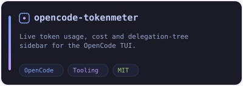
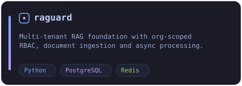
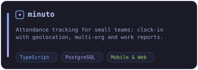
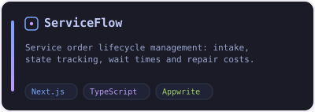
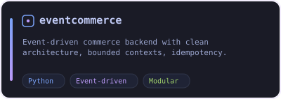
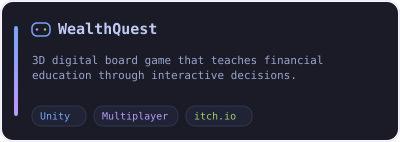

<div align="center">
  
</div>

<h1 align="center">Hi, I'm Jonathan Soto 👋</h1>

<p align="center">
  <a href="https://git.io/typing-svg">
    
  </a>
</p>

<p align="center">
  <a href="https://github.com/JonaSotoAguilar">
    
  </a>
  <a href="https://github.com/JonaSotoAguilar">
    
  </a>
  <a href="mailto:jonathansoto.dev@gmail.com">
    
  </a>
</p>

---

## About me

I'm a software engineer focused mainly on **backend development**: designing maintainable systems, clear APIs and practical tools that solve real problems with **Python, Java, JavaScript/TypeScript** and modern development practices.

I'm also exploring how **AI agents and structured engineering workflows** can improve real software delivery: **Test-Driven Development (TDD)**, **Spec-Driven Development (SDD)**, **Receipt-Driven Development (RDD)**, **OpenSpec**, code analysis, automation and verifiable review.

📍 Santiago, Chile · Open to remote work

## What I build

- Backend APIs and domain-oriented services.
- Full-stack applications with React, Next.js and TypeScript.
- Developer automation workflows and productivity tooling.
- AI-assisted software workflows using coding agents and local tooling.
- Games and interactive learning experiences (Unity, itch.io).

## Current focus

```text
Backend architecture       ████████████████████░░  90%
Python / Java services     ███████████████████░░░  85%
TypeScript full-stack      ████████████████░░░░░░  75%
AI-assisted development    ███████████████░░░░░░░  70%
Rust tooling               ██████████░░░░░░░░░░░░  45%
```

## Tech stack

### Backend


### Frontend


### Data & DevOps


### AI-assisted development

<p align="center">
  
  
  
  
  
</p>

<p align="center"><sub>Tests first · Specs before implementation · Receipts for verifiable review · Durable change artifacts</sub></p>

## Featured projects

<div align="center">

<a href="https://github.com/jonasotoaguilar/opencode-tokenmeter">
  
</a>
<a href="https://github.com/jonasotoaguilar/raguard">
  
</a>
<a href="https://github.com/jonasotoaguilar/minuto">
  
</a>
<a href="https://github.com/jonasotoaguilar/ServiceFlow">
  
</a>
<a href="https://github.com/jonasotoaguilar/eventcommerce">
  
</a>
<a href="https://jonasotoaguilar.itch.io/wealthquest">
  
</a>

</div>

## GitHub stats

<p align="center">
  
</p>

<p align="center">
  
  
  
</p>

## Contact

If you want to collaborate, talk about backend engineering, AI-assisted development or build useful developer tools, reach me here:

<p align="center">
  <a href="mailto:jonathansoto.dev@gmail.com">
    
  </a>
  <a href="https://github.com/JonaSotoAguilar">
    
  </a>
</p>

---

<p align="center">
  <em>Building useful systems, learning constantly and using AI as a tool to think and execute better.</em>
</p>
